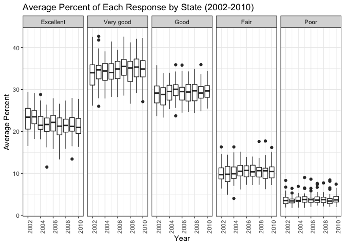

Homework 3
================
Marisa Sobel
10/7/2018

## Problem 1

Data cleaning

``` r
# add library that includes dataset 
library("p8105.datasets")

# import brfss_smart2010 data, clean names, filter by "Overall Health", remove unwanted vars
# make "response" a factor variable

brfss_data = 
  brfss_smart2010 %>% 
  janitor::clean_names() %>% 
  filter(topic == "Overall Health") %>% 
  select(-class, -topic, -question, 
         -sample_size, -(confidence_limit_low:geo_location)) %>% 
  mutate(
    response = factor(response, 
                      levels = c("Excellent", "Very good", "Good", "Fair", "Poor"))
  )
```

### Questions

1.  *_In 2002, which states were observed at 7
locations?_*

<!-- end list -->

``` r
# Filter by year, group by state, summarize number of locations in each state

brfss_data %>% 
  filter(year == 2002) %>% 
  group_by(locationabbr) %>% 
  summarise(
    number = n_distinct(locationdesc)
  ) %>% 
  filter(number == 7)
## # A tibble: 3 x 2
##   locationabbr number
##   <chr>         <int>
## 1 CT                7
## 2 FL                7
## 3 NC                7
```

**Connecticut, Florida, and North Caroline** were observed at 7
locations in 2002.

2.  *_Make a “spaghetti plot” that shows the number of observations in
    each state from 2002 to
2010._*

<!-- end list -->

``` r
# Group by year and state, summarize number of locations in each state (n)
# Line plot of year vs n, turn off legend --> too many states

brfss_data %>% 
  group_by(year, locationabbr) %>% 
  summarise(
    number = n()) %>% 
  ggplot(aes(x = year, y = number, color = locationabbr)) +
  geom_line() +
   labs(
    title = "Number of Observations by State (2002-2010)", 
    x = "Year", 
    y = "Number of Obs", 
    legend = "State") +
  viridis::scale_color_viridis(discrete = TRUE) +
  theme(legend.position = "none")
```

<!-- -->

3.  *_Make a table showing, for the years 2002, 2006, and 2010, the mean
    and standard deviation of the proportion of “Excellent” responses
    across locations in NY State._*

<!-- end list -->

``` r
# Filter: 1) NY, 2) year (2002, 2006, 2010)
# Group by location 
# "data_value" = proportion 

brfss_data %>% 
  filter(locationabbr == "NY") %>% 
  filter(year == 2002 | year == 2006 | year == 2010) %>% 
  filter(response == "Excellent") %>% 
  group_by(year) %>% 
  summarise(
    mean_excellent = mean(data_value), 
    sd_excellent = sd(data_value)
  )
## # A tibble: 3 x 3
##    year mean_excellent sd_excellent
##   <int>          <dbl>        <dbl>
## 1  2002           24.0         4.49
## 2  2006           22.5         4.00
## 3  2010           22.7         3.57
```

4.  *_For each year and state, compute the average proportion in each
    response category (taking the average across locations in a state).
    Make a five-panel plot that shows, for each response category
    separately, the distribution of these state-level averages over
    time._*

<!-- end list -->

``` r
# Group by year, state, and response, mean of "data_value"
# Line plot year vs mean, facet by "response", turn off legend --> too many states 

brfss_data %>% 
  group_by(year, locationabbr, response) %>% 
  summarise(
    mean = mean(data_value, na.rm = TRUE)
  ) %>% 
  ggplot(aes(x = year, y = mean, color = locationabbr)) +
  geom_line(alpha = .5) +
  facet_grid(~ response) + 
  labs(
    title = "Average Percent of Each Response by State (2002-2010)", 
    x = "Year", 
    y = "Average Percent", 
    legend = "State") +
  viridis::scale_color_viridis(discrete = TRUE) +
  theme(legend.position = "none")
```

<!-- -->

## Problem 2

``` r
# import dataset
instacart_data = instacart 
```

Data exploration

Short description, size and structure, key variables and illustrative
examples of obs

### Questions

1.  *_How many aisles are there, and which aisles are the most items
    ordered from?_*

2.  *_Make a plot that shows the number of items ordered in each aisle.
    Order aisles sensibly, and organize your plot so others can read
    it._*

3.  *_Make a table showing the most popular item aisles “baking
    ingredients”, “dog food care”, and “packaged vegetables fruits”._*

4.  *_Make a table showing the mean hour of the day at which Pink Lady
    Apples and Coffee Ice Cream are ordered on each day of the week;
    format this table for human readers (i.e. produce a 2 x 7 table)._*

## Problem 3

``` r
# import dataset
ny_noaa_data = ny_noaa 
```

Data exploration

Short description, size and structure, key variables, indicating the
extent to which missing data is an issue.

### Questions

1.  *_Do some data cleaning. Create separate variables for year, month,
    and day. Ensure observations for temperature, precipitation, and
    snowfall are given in reasonable units. For snowfall, what are the
    most commonly observed values? Why?_*

2.  *_Make a two-panel plot showing the average temperature in January
    and in July in each station across years. Is there any observable /
    interpretable structure? Any outliers?_*

3.  *_Make a two-panel plot showing (i) tmax vs tmin for the full
    dataset (note that a scatterplot may not be the best option); and
    (ii) make a plot showing the distribution of snowfall values greater
    than 0 and less than 100 separately by year._*
