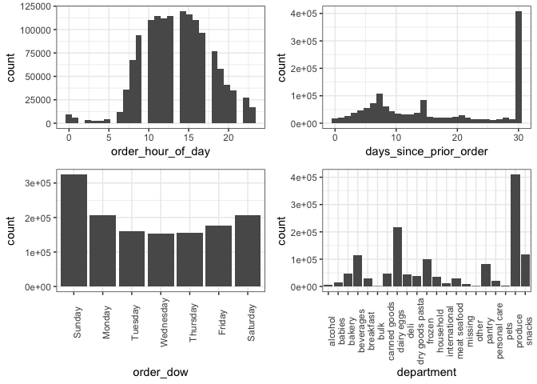
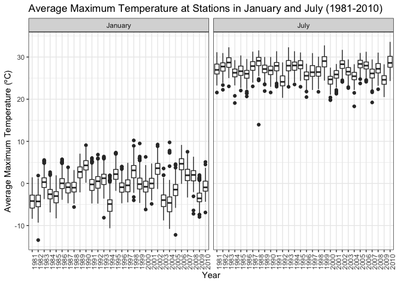
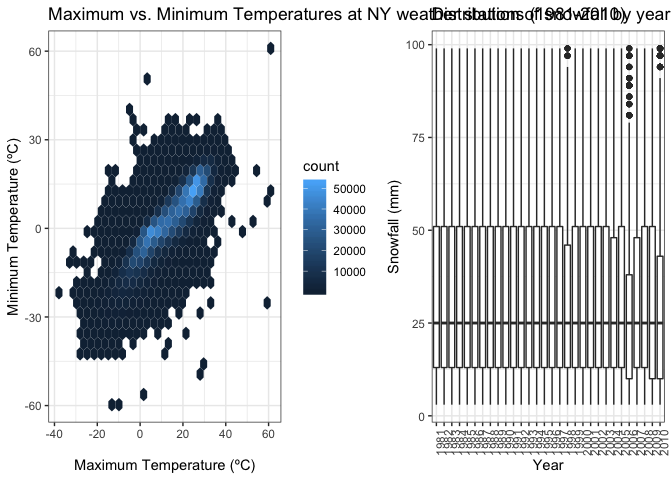

Homework 3
================
Marisa Sobel
10/7/2018

## Problem 1

Data
cleaning

``` r
# import brfss_smart2010 data, clean names, filter by "Overall Health", remove unwanted vars
# make "response" a factor variable
brfss_data = 
  brfss_smart2010 %>% 
  janitor::clean_names() %>% 
  filter(topic == "Overall Health") %>% 
  select(-class, -topic, -question, 
         -sample_size, -(confidence_limit_low:geo_location)) %>% 
  mutate(
    response = factor(response, 
                      levels = c("Excellent", "Very good", "Good", "Fair", "Poor"))
  )
```

### Questions

1.  *_In 2002, which states were observed at 7
locations?_*

<!-- end list -->

``` r
# filter by year, group by state, summarize number of locations in each state
brfss_data %>% 
  filter(year == 2002) %>% 
  group_by(locationabbr) %>% 
  summarise(
    number = n_distinct(locationdesc)
  ) %>% 
  filter(number == 7)
## # A tibble: 3 x 2
##   locationabbr number
##   <chr>         <int>
## 1 CT                7
## 2 FL                7
## 3 NC                7
```

**Connecticut, Florida, and North Carolina** were observed at 7
locations in 2002.

2.  *_Make a “spaghetti plot” that shows the number of locations in each
    state from 2002 to
2010._*

<!-- end list -->

``` r
# group by year and state, summarize number of locations in each state (n)
# line plot of year vs n, turn off legend --> too many states
brfss_data %>% 
  group_by(year, locationabbr) %>% 
  summarise(
    number = n_distinct(locationdesc)) %>% 
  ggplot(aes(x = year, y = number, color = locationabbr)) +
  geom_line() +
   labs(
    title = "Number of Observations by State (2002-2010)", 
    x = "Year", 
    y = "Number of Obs", 
    legend = "State") +
  viridis::scale_color_viridis(discrete = TRUE) +
  theme(legend.position = "none")
```

<!-- -->

3.  *_Make a table showing, for the years 2002, 2006, and 2010, the mean
    and standard deviation of the proportion of “Excellent” responses
    across locations in NY State._*

<!-- end list -->

``` r
# filter: 1) NY, 2) year (2002, 2006, 2010)
# group by location 
# "data_value" = proportion 
excellent_table = 
brfss_data %>% 
  filter(locationabbr == "NY") %>% 
  filter(year == 2002 | year == 2006 | year == 2010) %>% 
  filter(response == "Excellent") %>% 
  group_by(year) %>% 
  summarise(
    mean = mean(data_value),
    std_dev = sd(data_value))
```

**Average and standard deviation of proportion of “Excellent” responses
in NY**

| year |  mean | std\_dev |
| ---: | ----: | -------: |
| 2002 | 24.04 |     4.49 |
| 2006 | 22.53 |     4.00 |
| 2010 | 22.70 |     3.57 |

4.  *_For each year and state, compute the average proportion in each
    response category (taking the average across locations in a state).
    Make a five-panel plot that shows, for each response category
    separately, the distribution of these state-level averages over
    time._*

<!-- end list -->

``` r
# group by year, state, and response, mean of "data_value"
# boxplot plot year vs mean, group by year, facet by "response"
brfss_data %>% 
  group_by(year, locationabbr, response) %>% 
  summarise(
    mean = mean(data_value, na.rm = TRUE)
  ) %>% 
  ggplot(aes(x = year, y = mean, group = year)) +
  geom_boxplot() +
  facet_grid(~ response) + 
  labs(
    title = "Average Percent of Each Response by State (2002-2010)", 
    x = "Year", 
    y = "Average Percent") +
  theme(axis.text.x = element_text(angle = 90))
```

<!-- -->

## Problem 2

*_Write a short description of the dataset, noting the size and
structure of the data, describing some key variables, and giving
illstrative examples of observations._*

Data exploration

``` r
# import dataset
instacart_data = instacart 

# percent reordered
instacart_data %>% 
  summarise(
    sum(reordered)/nrow(instacart_data)*100)
## # A tibble: 1 x 1
##   `sum(reordered)/nrow(instacart_data) * 100`
##                                         <dbl>
## 1                                        59.9

# average order number
instacart_data %>% 
  summarise(mean(order_number))
## # A tibble: 1 x 1
##   `mean(order_number)`
##                  <dbl>
## 1                 17.1

# histogram: hour of day 
hour_of_day_plot = 
  instacart_data %>% 
  ggplot(aes(x = order_hour_of_day)) +
  geom_histogram()

# histogram: days since prior order
days_since_prior_order_plot = 
  instacart_data %>% 
  ggplot(aes(x = days_since_prior_order)) +
  geom_histogram()

# histogram: day of week
dow_plot = 
  instacart_data %>% 
  mutate(
    order_dow = 
      ordered(order_dow, 
              levels = c(0:6), 
              labels = c("Sunday", "Monday", "Tuesday", 
                         "Wednesday", "Thursday", "Friday", 
                         "Saturday"))) %>% 
  ggplot(aes(x = order_dow)) +
  geom_bar() +
  theme(axis.text.x = element_text(angle = 90))

# histogram: department
department_plot = 
  instacart_data %>% 
  ggplot(aes(x = department)) +
  geom_bar() +
  theme(axis.text.x = element_text(angle = 90))

(hour_of_day_plot + days_since_prior_order_plot) / (dow_plot + department_plot)
## `stat_bin()` using `bins = 30`. Pick better value with `binwidth`.
## `stat_bin()` using `bins = 30`. Pick better value with `binwidth`.
```

<!-- -->

In the present Instacart dataset, there are **1384617** observations of
specific items ordered with information across **15** variables.
**59.9%** of items were reorded from previous orders. The listed order
was, on average, the **17th** order for individuals. Key variables
include the day of the week orders were made (`order_dow` with 0 coded
as Sunday), the hour of the day the order was made
(`order_hour_of_day`), product name (`product_name`), aisle of the
product (`aisle`), and department the product is in (`department`).
Histograms (shown above) show that: Sunday is the most popular day,
midday is the most time of day, most people wait a full month before
ordering, and perishables are the most popular types of items purchased.

### Questions

1.  *_How many aisles are there, and which aisles are the most items
    ordered from?_*

<!-- end list -->

``` r
# distinct aisles
instacart_data %>% 
  summarise(number = n_distinct(aisle_id))
## # A tibble: 1 x 1
##   number
##    <int>
## 1    134

# number of items in each aisle --> arrange desc
instacart_data %>%
  group_by(aisle) %>% 
  summarise(number = n()) %>% 
  arrange(desc(number))
## # A tibble: 134 x 2
##    aisle                         number
##    <chr>                          <int>
##  1 fresh vegetables              150609
##  2 fresh fruits                  150473
##  3 packaged vegetables fruits     78493
##  4 yogurt                         55240
##  5 packaged cheese                41699
##  6 water seltzer sparkling water  36617
##  7 milk                           32644
##  8 chips pretzels                 31269
##  9 soy lactosefree                26240
## 10 bread                          23635
## # ... with 124 more rows
```

There are **134** distinct aisles. **Fresh vegetables** and **frush
fruits** are the two most frequenly ordered from aisles by a factor of
10, followed by **package vegetables/fruits, yogurt, and packaged
cheese**.

2.  *_Make a plot that shows the number of items ordered in each aisle.
    Order aisles sensibly, and organize your plot so others can read
    it._*

<!-- end list -->

``` r
# group by aisle and department --> summarise number of items in aisle
# cannot get items to order max to min in chart
# highlighting by department to see the spread more easily
instacart_data %>%
  group_by(aisle, department) %>% 
  summarise(number = n()) %>% 
  arrange(desc(number)) %>% 
  ggplot(aes(x = aisle, y = number, color = department)) +
  geom_bar(stat = "identity") +
  labs(
    y = "Number of items ordered", 
    x = "Aisle ID",
    title = "Number of items ordered by aisles"
  ) +
  viridis::scale_color_viridis(discrete = TRUE) +
  theme(axis.text.x = element_text(angle = 90, hjust=1, vjust=0.5, size = 6)) +
  theme(legend.position = "bottom") +
  guides(col = guide_legend(nrow = 3))
```

<!-- -->

3.  *_Make a table showing the most popular item in each of the aisles
    “baking ingredients”, “dog food care”, and “packaged vegetables
    fruits”._*

<!-- end list -->

``` r
# filter by aisles, group by aisle/product, sum counts, find top 1 in each
table_max =
  instacart_data %>% 
  filter(aisle == "baking ingredients" | aisle == "dog food care" | 
           aisle == "packaged vegetables fruits") %>% 
  group_by(aisle, product_name) %>% 
  summarise(
    n = n()) %>%
  top_n(1) %>% 
  rename(
    Aisle = aisle, 
    Item = product_name, 
    Counts = n)
## Selecting by n
```

**Most popular item in selected
aisles**

| Aisle                      | Item                                          | Counts |
| :------------------------- | :-------------------------------------------- | -----: |
| baking ingredients         | Light Brown Sugar                             |    499 |
| dog food care              | Snack Sticks Chicken & Rice Recipe Dog Treats |     30 |
| packaged vegetables fruits | Organic Baby Spinach                          |   9784 |

4.  *_Make a table showing the mean hour of the day at which Pink Lady
    Apples and Coffee Ice Cream are ordered on each day of the week;
    format this table for human readers (i.e. produce a 2 x 7 table)._*

<!-- end list -->

``` r
# mean hour of the day each object is purchases on each day of the week
# filter by product, group by products/dow, spread, label dow, rename for table
mean_hour_table = 
instacart_data %>% 
  filter(product_name == "Pink Lady Apples" | 
           product_name == "Coffee Ice Cream") %>% 
  group_by(product_name, order_dow) %>% 
  summarise(
    mean_hour = mean(order_hour_of_day)) %>% 
  spread(key = product_name, value = mean_hour) %>% 
  mutate(
    order_dow = ordered(order_dow, levels = c(0:6), 
                        labels = c("Sunday", "Monday", 
                                   "Tuesday", "Wednesday", "Thursday", 
                                   "Friday", "Saturday")
                        )) %>% 
  rename("Day of Week" = order_dow)
```

**Average hour of the day products are purchased (24hr)**

| Day of Week | Coffee Ice Cream | Pink Lady Apples |
| :---------- | ---------------: | ---------------: |
| Sunday      |            13.77 |            13.44 |
| Monday      |            14.32 |            11.36 |
| Tuesday     |            15.38 |            11.70 |
| Wednesday   |            15.32 |            14.25 |
| Thursday    |            15.22 |            11.55 |
| Friday      |            12.26 |            12.78 |
| Saturday    |            13.83 |            11.94 |

## Problem 3

Data exploration

``` r
# import dataset
ny_noaa_data = ny_noaa 

ny_noaa_data %>% 
  filter(is.na(prcp), is.na(snow), is.na(snwd), is.na(tmax), is.na(tmin)) %>% 
  nrow()
## [1] 72278

ny_noaa_data %>% 
  filter(is.na(prcp) | is.na(snow) | is.na(snwd) | is.na(tmax) | is.na(tmin)) %>% 
  nrow()
## [1] 1372743
```

*_Write a short description of the dataset, noting the size and
structure of the data, describing some key variables, and indicating the
extent to which missing data is an issue._*

In the present Instacart dataset, there are **2595176** observations
with information across **7** variables. Key variables include date of
observation (`date`), precipidataion (1/10 mm; `prcp`), snowfall (mm;
`snow`), snowdepth (mm; `snwd`), maximum temperature (10th ºC; `tmax`),
and minimum temperature (10th ºC; `tmin`). Looking at the dataset, there
is extensive mising data. **72278** observations are missing all of the
key variables, which is **2.79** % of the dataset. However, **1372743**
observations are missing at least one of the key variables, which is
**52.9** %, or just about half, of the dataset.

### Questions

1.  *_Do some data cleaning. Create separate variables for year, month,
    and day. Ensure observations for temperature, precipitation, and
    snowfall are given in reasonable units. For snowfall, what are the
    most commonly observed values? Why?_*

<!-- end list -->

``` r
# separate date variable, change 1/10th unit values by dividing by 10
ny_noaa_data = 
  ny_noaa_data %>% 
  separate(date, c("year", "month", "day")) %>% 
  mutate(
    prcp = prcp/10, 
    tmax = as.numeric(tmax)/10, 
    tmin = as.numeric(tmin)/10
  )

# most commonly observed values for snowfall --> count values and arrange desc
ny_noaa_data %>% 
  count(snow) %>% 
  arrange(desc(n))
## # A tibble: 282 x 2
##     snow       n
##    <int>   <int>
##  1     0 2008508
##  2    NA  381221
##  3    25   31022
##  4    13   23095
##  5    51   18274
##  6    76   10173
##  7     8    9962
##  8     5    9748
##  9    38    9197
## 10     3    8790
## # ... with 272 more rows
```

For snowfall, the most commonly observed value is **0 mm**, which makes
sense as most days of the year is is not snowing in New York.

2.  *_Make a two-panel plot showing the average temperature in January
    and in July in each station across years. Is there any observable /
    interpretable structure? Any outliers?_*

<!-- end list -->

``` r
# filter by month (January and July), change month names for plot
# group by year/month/id to get averages of each station in year/month --> sum excluding missing
# boxplot --> exclude missing, facet by month, label, rotate years (x-axis)
ny_noaa_data %>% 
  filter(month == "01" | month == "07") %>% 
  mutate(
    month = month.name[as.numeric(month)]) %>% 
  group_by(year, month, id) %>% 
  summarise(
    mean_tmax = mean(tmax, na.rm = TRUE)) %>% 
  ggplot(aes(x = year, y = mean_tmax, group = year)) +
  geom_boxplot(na.rm = TRUE) +
  facet_grid(~ month) +
  labs(
    title = "Average Maximum Temperature at Stations in January and July (1981-2010)", 
    x = "Year", 
    y = "Average Maximum Temperature (ºC)", 
    legend = "State") +
  theme(axis.text.x = element_text(angle = 90))
```

<!-- -->

There are outliers in both plots. There are mostly high temperature
outliers in January and low temperature outliers in July.

3.  *_Make a two-panel plot showing (i) tmax vs tmin for the full
    dataset (note that a scatterplot may not be the best option); and
    (ii) make a plot showing the distribution of snowfall values greater
    than 0 and less than 100 separately by year._*

<!-- end list -->

``` r
tmax_tmin_plot = 
  ny_noaa_data %>% 
  ggplot(aes(x = tmax, y = tmin, color = )) +
  geom_hex(na.rm = TRUE) +
  theme(legend.position = "right") +
  labs(
    title = "Maximum vs. Minimum Temperatures at NY weather stations (1981-2010)", 
    x = "Maximum Temperature (ºC)", 
    y = "Minimum Temperature (ºC)"
  ) +
  viridis::scale_color_viridis()

snow_dist = 
  ny_noaa_data %>% 
  filter(snow > 0 & snow < 100) %>% 
  group_by(year) %>% 
  ggplot(aes(x = year, y = snow, group = year)) +
  geom_boxplot() +
  theme(axis.text.x = element_text(angle = 90)) +
  labs(
    title = "Distribution of snowfall by year (1981-2010)", 
    y = "Snowfall (mm)",
    x = "Year"
  )

tmax_tmin_plot + snow_dist
```

<!-- -->
